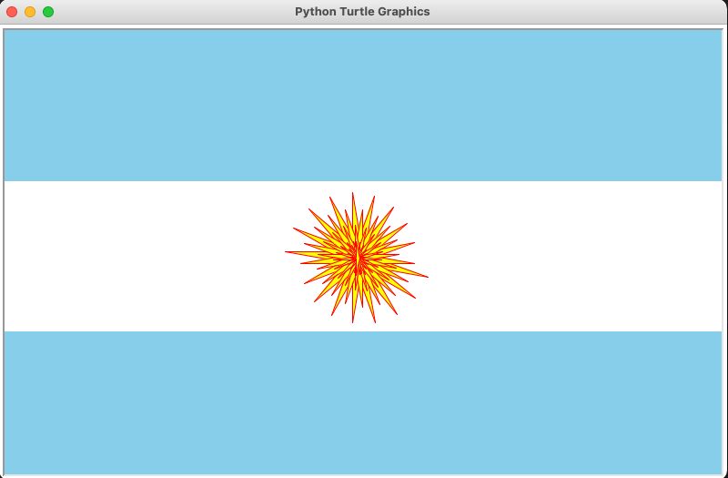

# This file was used to design the Argentina Flag with Python Turtle Module. 
# The top and bottom thirds are horizontal skyblue colors while the middle third is a sun with yellow inside and red outline with lots of sun rays

